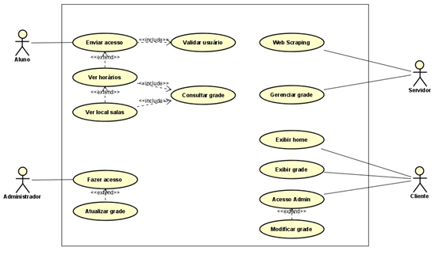

# Repositório oficial Horários FATEC RP

Este é o repositório oficial do TCC Horários FATEC RP.
Desenvolvido por Arthur Galanti e Ítalo Covas.
Link de produção: https://horarios-fatec-rp.vercel.app/

## Diagrama de caso de uso

## Telas

Fotos das telas

### Landing Page (parte 1)

### Landing Page (parte 2)

### Landing Page - Login aluno

### Tela principal - horários

### Tela principal - mapa da sala aberto

### Tela de Admin - Login admin

### Tela de Admin - Upload admin

### Tela de Admin - Upload admin (Detalhes cabeçalho)

